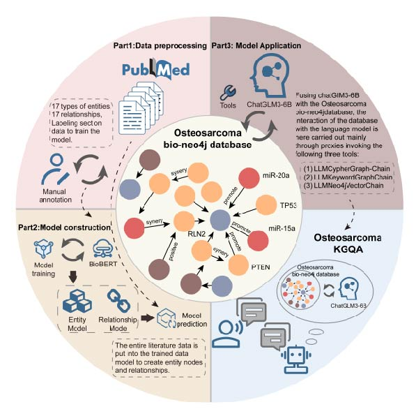

## Osteosarcoma LLM 

[](https://github.com/L-0606/Osteosarcoma_KGQA/)
[](https://www.repostatus.org/#active)
[](https://app.codacy.com/gh/L-0606/Osteosarcoma_KGQA/dashboard?utm_source=gh&utm_medium=referral&utm_content=&utm_campaign=Badge_grade)

## Introduction

This is a single-disease osteosarcoma knowledge graph-based Q&A system incorporating ChatGLM3-6b.

By manually annotating and integrating more than `20,000` articles on osteosarcoma from Pumbed, we established the first knowledge graph for osteosarcoma. We also applied this graph and chatGLM3 to develop a question-answering model. It can overcome the "illusion" of the large model and help researchers find the knowledge they need more easily and accurately. The entity and relation model has been deposited at Zenodo (https://zenodo.org/records/14012425).



## A notice on operating system compatibility
- **Python**: We developed this method using python version 3.10.x.
- **CUDA**:  We developed this method using python version 12.0
- **neo4j**:  We developed this method using python version 5.15.0.

## Before installation
We used a computer equipped with an RTX 4090 graphics card for the experiment. For stability and improved computing efficiency, we recommend using a computer with RTX 3090 or above.
## usage
``` bash
# Firstly, run the neo4j database. (localhost:7474) 
  neo4j start
# Secondly, run the ChatGLM3-6b model. (localhost:8000) 
  python openai_api.py 
# Back-end Run 
  python main.py 
```


